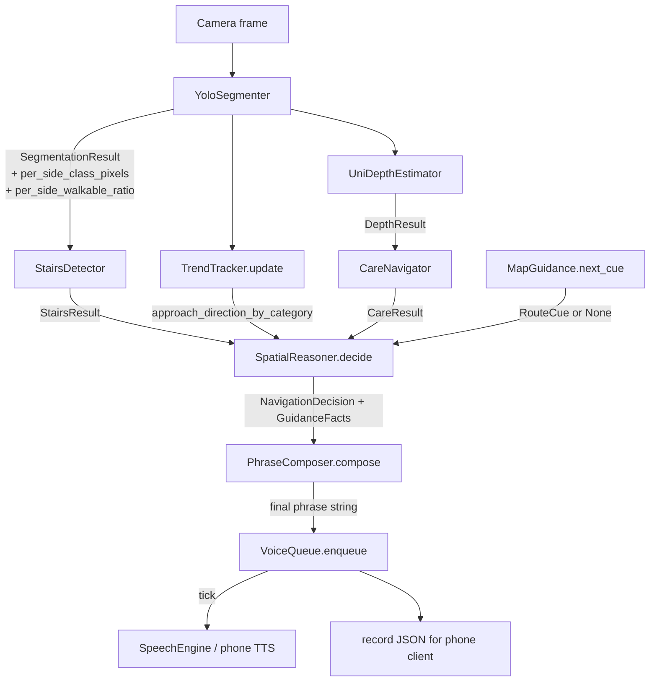

# Design Document

## Overview

This design upgrades the current rule-based commands ("stop", "go forward") into a spatially aware, natural-sounding direction guidance system. It is **Path A — smart rule-based composition with a template phrase library**. No LLM, VLM, or new ML model is added; all signals come from the existing YOLO Cityscapes segmenter, the CARE reasoning layer, the segmentation-based 3-bucket depth proxy, and OSRM walking routes.

The core architectural moves are:

1. **Per-side spatial perception** lifted into the existing one-pass scan over the segmentation `class_map` — left / center / right thirds, with weighted obstacle counts and walkable ratios reported as new optional fields on `SegmentationResult`.
2. **A new reasoning component, `SpatialReasoner`,** that consumes a `PerceptionBundle` plus an optional `RouteCue` and emits a structured `GuidanceFacts` object plus a final `NavigationDecision`. This wraps and replaces the decision branch currently inside `NavigationInterpreter._heuristic`. The legacy `NavigationInterpreter` stays callable for the CLI behind `--legacy-reasoner` so all existing tests stay green.
3. **A new composer, `PhraseComposer`,** that loads `config/phrases.yaml` once at construction and turns `GuidanceFacts` into a final spoken phrase using paraphrases per scenario tag.
4. **A heuristic stairs/curb detector, `StairsDetector`,** that scans the bottom 30% of the walkable region for horizontal-edge discontinuities. It satisfies a small `(frame, segmentation) → StairsResult` contract so a future trained model can swap in.
5. **A trend tracker, `TrendTracker`,** extracted from the existing `AlertTracker` — `AlertTracker` keeps its public API (still used for proximity alerts), but the centroid / ring-buffer logic moves into a reusable per-category trend module. `TrendTracker` labels each tracked category as `static`, `crossing_left_to_right`, `crossing_right_to_left`, `closing_in`, or `receding`.
6. **A priority voice queue, `VoiceQueue`,** in the output layer with five tiers (`vision_stop`, `directional_warning`, `map_turn`, `approach_alert`, `status_update`) and per-tier cooldowns. Vision STOP always preempts.
7. **A swappable `bucketize(depth_m)` function** in `navigation/output/distance.py` (Req 15) — the only place that changes when real metric depth lands.
8. **Phone client gets a destination textbox** and the server gets `/set_destination`, geocoding through the existing `navigation.maps.router.geocode_address` helper.

### Hard architectural constraints (encoded directly into the design)

- New modules live in their declared layers (no upward imports). The composer lives in **reasoning**, the voice queue lives in **output**, the new perception helpers stay in **perception**.
- No new heavy dependencies. `PhraseComposer` uses `pyyaml` (already a dep). `VoiceQueue` is pure Python. `StairsDetector` uses `numpy` + `cv2` (already there). `pydantic` already present.
- Median full-pipeline frame time stays under **100 ms** (Req 11). Per-side counts share the existing single pass over `class_map`; `StairsDetector` operates on a downscaled view; `PhraseComposer` loads YAML once.
- **Vision STOP always wins** (Req 13). Structurally guaranteed by the ordering inside `SpatialReasoner.decide()`: the `vision_stop` flag is computed first and short-circuits every other branch, and `VoiceQueue` preempts every lower tier when a `vision_stop` item is enqueued.
- All 47 existing tests remain green. Tolerances on existing assertions are NOT bumped; the new fields default to `None`, the legacy reasoner branch is preserved, and `AlertTracker.update()` keeps its current signature.

### File-level deliverables

| Path | Status | Purpose |
|---|---|---|
| `navigation/perception/spatial.py` | new | `_per_side_class_pixels()`, `_per_side_walkable_ratio()` helpers; reuses existing `_region_weight_map` from `navigation/perception/segmentation.py`. |
| `navigation/perception/segmentation.py` | extend | Populate the two new optional fields on `SegmentationResult` from `_parse_semantic`. `_parse_instance` and `_mock` keep returning `None` (mock fills with zeroed dicts per Req 1.6). |
| `navigation/perception/stairs.py` | new | `StairsDetector` class with `(frame, segmentation) → StairsResult` contract. |
| `navigation/reasoning/trend.py` | new | `TrendTracker` (per-category centroid ring buffer). `AlertTracker` keeps working; centroid logic factored out so both consume it. |
| `navigation/reasoning/facts.py` | new | `GuidanceFacts` pydantic model (the contract between reasoner and composer) plus supporting types (`HazardEntry`, `ApproachDirection`, `Side`, `RouteCue`). |
| `navigation/reasoning/spatial_reasoner.py` | new | `SpatialReasoner.decide(SegmentationResult, DepthResult, CareResult, RouteCue \| None) → (NavigationDecision, GuidanceFacts)`. |
| `navigation/reasoning/composer.py` | new | `PhraseComposer.compose(GuidanceFacts) → str`. Loads `config/phrases.yaml`. |
| `navigation/output/voice_queue.py` | new | `VoiceQueue` with five tiers, per-tier cooldowns, `enqueue()`/`tick()`. |
| `navigation/output/distance.py` | new | `bucketize(depth_m, cfg) → (DistanceBucket, str)` (Req 15). |
| `navigation/models.py` | extend | Add `per_side_class_pixels` and `per_side_walkable_ratio` optional fields to `SegmentationResult`. Default `None`. |
| `navigation/config.py` | extend | Add `Settings.benchmark_mode`, `min_lane_walkable_ratio`, `stairs_detector_enabled`, `stairs_min_edge_density`, `status_update_interval_sec`, plus per-tier voice cooldown defaults. |
| `navigation/pipeline/runner.py` | extend | `process_frame` injects `TrendTracker`, `SpatialReasoner`, `PhraseComposer`, `VoiceQueue`. `--legacy-reasoner` keeps the old path callable. |
| `navigation/cli.py` | extend | Wire `--legacy-reasoner` and `--benchmark` flags. |
| `phone_server.py` | extend | Inject the new components, add `/set_destination` route. Reuse `_pipeline_lock`. |
| `phone_client.html` | extend | Destination text input + Set button + JS handler that POSTs `address`. |
| `config/phrases.yaml` | new | 3–5 paraphrases per scenario tag (15 scenarios). |
| `config/default.yaml` | extend | New `distance:` and `voice:` blocks. |
| `tests/test_spatial.py` | new | Per-side counts and walkable ratios. |
| `tests/test_stairs.py` | new | `StairsDetector` algorithm. |
| `tests/test_trend.py` | new | `TrendTracker` classification. |
| `tests/test_composer.py` | new | `PhraseComposer` paraphrasing & placeholder substitution. |
| `tests/test_voice_queue.py` | new | Priority preemption & per-tier cooldowns. |
| `tests/test_spatial_reasoner.py` | new | Decision flow, vision-STOP override, map+vision blend. |
| `tests/test_distance.py` | new | `bucketize` thresholds and phrases. |
| `tests/test_runner.py` | extend | End-to-end smoke through `composer + queue` (kept additive — no existing assertions changed). |
| `tests/test_phone_server.py` | new | `/set_destination` happy path + 400 + 422. |

## Architecture

### Layering (unchanged)

```
utils → config → models → capture → perception → reasoning → maps → output → pipeline → cli
```

The new modules respect the existing rule that lower layers never import from higher layers. Specifically:

- `navigation/perception/spatial.py` and `navigation/perception/stairs.py` import only from `numpy`, `cv2`, `navigation.config`, `navigation.models`, and the existing perception siblings.
- `navigation/reasoning/facts.py`, `composer.py`, `trend.py`, `spatial_reasoner.py` import from `navigation.config`, `navigation.models`, `navigation.maps`, and `navigation.reasoning.*`.
- `navigation/output/voice_queue.py` and `distance.py` import from `navigation.config` and `navigation.models` only. **The voice queue does not import from `navigation.pipeline` or `navigation.cli`.**
- `phone_server.py` and `navigation/pipeline/runner.py` are the only places that wire the new modules together. They import from every lower layer.

### Data flow (Mermaid)



Performance notes embedded in the diagram:

- B → spatial helpers add **no extra pass** over `class_map`; per-side counts are accumulated in the same `for cls_id in np.unique(class_map):` loop already in `_parse_semantic`.
- C runs on a downscaled view, **bounded constant cost** ~1–2 ms.
- D is `O(buffer_size × tracked_categories)` ≈ `O(6 × 7)` = 42 ops per frame.
- F is `O(C)` in tracked categories; no frame-pixel work.
- I is `O(P)` in paraphrases for the chosen scenario (≤ 5).
- J is in-memory only.

### Wire-up

#### `navigation/pipeline/runner.py::process_frame`

```python
def process_frame(
    frame, frame_id, settings, *,
    dry_run, segmenter, depth_est, care,
    interpreter,                # legacy NavigationInterpreter — kept for back-compat
    spatial_reasoner,           # NEW
    composer,                   # NEW PhraseComposer
    voice_queue,                # NEW VoiceQueue
    trend_tracker,              # NEW TrendTracker
    stairs_detector,            # NEW StairsDetector
    validator, tts,
    alert_tracker=None,
    use_legacy_reasoner=False,  # NEW — CLI flag --legacy-reasoner sets True
    position=None,
    show_seg=False, seg_save_dir=None, seg_block=False, hud=None,
) -> dict:
    seg = segmenter.predict(frame, dry_run=dry_run)
    depth = depth_est.predict(frame, dry_run=dry_run, segmentation=seg)
    care_out = care.predict(frame, seg, depth, dry_run=dry_run)

    if use_legacy_reasoner:
        # Existing path, unchanged. Used by CLI when --legacy-reasoner is set
        # and by every test in tests/test_heuristic.py / tests/test_runner.py
        # that calls NavigationInterpreter directly.
        bundle = PerceptionBundle(frame_id=frame_id, segmentation=seg, depth=depth, care=care_out)
        decision = interpreter.interpret(bundle, dry_run=dry_run, position=position)
        decision = validator.approve(decision)
        phrase = tts.speak(decision) if decision.speak else None
        # alerts unchanged
        ...
        return record

    # NEW spatial path
    stairs = stairs_detector.detect(frame, seg)
    trend_tracker.update(seg.per_side_class_pixels or {})
    approach_by_category = trend_tracker.classify_all()
    route_cue = _next_route_cue(interpreter, position)  # MapGuidance lookup; None if no route

    decision, facts = spatial_reasoner.decide(
        seg, depth, care_out, route_cue,
        stairs=stairs,
        approach_by_category=approach_by_category,
    )
    decision = validator.approve(decision)

    phrase = composer.compose(facts)
    tier = _classify_tier(facts)  # vision_stop / directional_warning / map_turn / status_update
    voice_queue.enqueue(VoiceItem(tier=tier, phrase=phrase, frame_id=frame_id))
    spoken = voice_queue.tick()
    if spoken is not None:
        tts._say(spoken)  # bypass speak()'s NavigationDecision-only path

    spoken_alerts = []
    if alert_tracker is not None:
        for alert in alert_tracker.update(seg):
            if validator.approve_alert(alert):
                voice_queue.enqueue(VoiceItem(tier="approach_alert", phrase=alert.phrase, frame_id=frame_id))
                spoken_alerts.append(alert)

    record = {
        "frame_id": frame_id,
        "command": decision.command.value,
        "confidence": decision.confidence,
        "rationale": decision.rationale,
        "speak": spoken is not None,
        "phrase": spoken or phrase,
        "alerts": [...],  # same shape as before
        "facts": facts.summary_dict(),  # for HUD/debug
    }
    ...
    return record
```

#### `phone_server.py`

```python
# At module load (existing pattern)
spatial_reasoner = SpatialReasoner(settings, map_guidance_provider=interpreter)
composer = PhraseComposer(settings)
voice_queue = VoiceQueue(settings)
trend_tracker = TrendTracker(settings)
stairs_detector = StairsDetector(settings)

@app.route("/set_destination", methods=["POST"])
def set_destination():
    address = (request.form.get("address") or "").strip()
    if not address:
        return jsonify({"ok": False, "error": "missing_address"}), 400
    try:
        lat, lon = geocode_address(address)
    except ValueError:
        return jsonify({"ok": False, "error": "address_not_found"}), 422
    with _pipeline_lock:
        # Mutate the running interpreter's destination & invalidate the
        # current MapGuidance instance so the next frame fetches a fresh
        # route from the new GPS position. We do not block here on the
        # OSRM call — the next /process_frame with GPS fetches it.
        interpreter.settings = interpreter.settings.model_copy(
            update={"dest_lat": lat, "dest_lon": lon, "use_map_guidance": True}
        )
        interpreter._map_guidance = None
        interpreter._map_route_attempted = False
    return jsonify({"ok": True, "lat": lat, "lon": lon, "address": address}), 200
```

The `/process_frame` handler is updated to inject `spatial_reasoner`, `composer`, `voice_queue`, `trend_tracker`, `stairs_detector` into a single call to `process_frame()` reused from `navigation.pipeline.runner`. Concurrency stays correct because everything runs under the existing `_pipeline_lock`.

#### `phone_client.html`

The destination input lives in a new toolbar above `#controls`. The handler sends `application/x-www-form-urlencoded`:

```html
<div id="dest-bar" style="position:absolute; top:env(safe-area-inset-top, 20px); left:20px; right:20px;">
  <input id="dest-input" type="text" placeholder="Destination" autocomplete="off"
         style="width:65%; padding:10px; border-radius:10px; border:none; font-size:16px;">
  <button id="set-dest-btn" style="padding:10px 18px; border-radius:10px; border:none;
          background:rgba(255,255,255,0.95); color:#111; font-weight:600;">Set</button>
</div>
<script>
async function setDestination() {
  const address = document.getElementById('dest-input').value.trim();
  if (!address) { dbg('destination empty'); return; }
  const body = new URLSearchParams({ address });
  try {
    const r = await fetch(SERVER_URL + '/set_destination', { method: 'POST', body });
    const j = await r.json();
    if (j.ok) {
      dbg('destination set:', j.address, '→', j.lat.toFixed(4) + ',' + j.lon.toFixed(4));
    } else {
      dbg('destination error:', j.error);
    }
  } catch (e) {
    dbg('destination request failed:', e.message);
  }
}
document.getElementById('set-dest-btn').addEventListener('click', setDestination);
document.getElementById('dest-input').addEventListener('keydown', (e) => {
  if (e.key === 'Enter') setDestination();
});
</script>
```

The destination bar is positioned above the existing status bar so it does not visually overlap the Start/Stop buttons (Req 8.1).

## Components and Interfaces

### `navigation/perception/spatial.py`

```python
from typing import Literal
import numpy as np

Side = Literal["left", "center", "right"]
SIDES: tuple[Side, ...] = ("left", "center", "right")


def _side_slices(width: int) -> dict[Side, slice]:
    """Split frame width into thirds; remainder columns go to center (Req 1.5)."""
    third = width // 3
    rem = width - third * 3
    left_end = third
    right_start = third * 2 + rem
    return {
        "left":   slice(0,            left_end),
        "center": slice(left_end,     right_start),
        "right":  slice(right_start,  width),
    }


def _per_side_class_pixels(
    class_map: np.ndarray,
    id_to_name: dict[int, str],
    weight_map: np.ndarray,
) -> dict[Side, dict[str, float]]:
    """Region-weighted pixel count for every class, per side.

    O(H × W) — runs only as part of the existing _parse_semantic pass.
    """
    h, w = class_map.shape[:2]
    slices = _side_slices(w)
    out: dict[Side, dict[str, float]] = {s: {} for s in SIDES}
    for side, sl in slices.items():
        cm_side = class_map[:, sl]
        wt_side = weight_map[:, sl]
        for cls_id in np.unique(cm_side):
            name = id_to_name.get(int(cls_id), str(int(cls_id)))
            mask = cm_side == cls_id
            out[side][name] = float(wt_side[mask].sum())
    return out


def _per_side_walkable_ratio(
    class_map: np.ndarray,
    id_to_name: dict[int, str],
    walkable_classes: set[str],
) -> dict[Side, float]:
    """Walkable pixel fraction per side, in [0, 1] (Req 2.2)."""
    h, w = class_map.shape[:2]
    slices = _side_slices(w)
    out: dict[Side, float] = {}
    for side, sl in slices.items():
        cm_side = class_map[:, sl]
        if cm_side.size == 0:
            out[side] = 0.0
            continue
        walkable_pixels = 0
        for cls_id in np.unique(cm_side):
            name = id_to_name.get(int(cls_id), str(int(cls_id)))
            if name in walkable_classes:
                walkable_pixels += int((cm_side == cls_id).sum())
        out[side] = float(walkable_pixels) / float(cm_side.size)
    return out
```

The existing `_region_weight_map(shape)` in `segmentation.py` is reused unchanged.

### `navigation/perception/stairs.py`

```python
from dataclasses import dataclass
import cv2
import numpy as np
from navigation.config import Settings
from navigation.models import SegmentationResult


@dataclass(frozen=True)
class StairsResult:
    flag: bool
    confidence: float
    rationale: str


class StairsDetector:
    """Heuristic stairs/curb detector. Future trained model is drop-in (Req 14)."""

    def __init__(self, settings: Settings):
        self.settings = settings
        self.min_edge_density = settings.stairs_min_edge_density  # default 0.08
        self.min_row_width_ratio = 0.30
        self.enabled = settings.stairs_detector_enabled  # default True

    def detect(self, frame: np.ndarray, segmentation: SegmentationResult) -> StairsResult:
        if not self.enabled:
            return StairsResult(False, 0.0, "disabled")

        cm = segmentation.class_map
        if cm is None or cm.ndim != 2:
            return StairsResult(False, 0.0, "no_class_map")

        h, w = cm.shape[:2]
        # Bottom 30% of the frame
        y0 = int(h * 0.70)
        cm_bot = cm[y0:, :]
        if cm_bot.size == 0:
            return StairsResult(False, 0.0, "empty_bottom")

        # Walkable mask in bottom region (Req 5.1)
        id_to_name = {int(k): str(v) for k, v in (segmentation.metadata or {}).get("id_to_name", {}).items()}
        walkable_set = set(self.settings.yaml_config().get("segmentation", {}).get("walkable_classes", []))
        walkable_mask_bot = np.isin(
            cm_bot,
            [cid for cid, name in id_to_name.items() if name in walkable_set],
        )
        if not walkable_mask_bot.any():
            return StairsResult(False, 0.0, "no_walkable_in_bottom")

        # Downscale for bounded cost (Req 5.7, 11.1)
        gray = cv2.cvtColor(frame, cv2.COLOR_BGR2GRAY) if frame.ndim == 3 else frame
        gray_bot = gray[y0:, :]
        if gray_bot.shape[1] > 256:
            scale = 256 / gray_bot.shape[1]
            gray_bot = cv2.resize(gray_bot, (256, max(8, int(gray_bot.shape[0] * scale))))
            walkable_mask_small = cv2.resize(
                walkable_mask_bot.astype(np.uint8),
                (gray_bot.shape[1], gray_bot.shape[0]),
                interpolation=cv2.INTER_NEAREST,
            ).astype(bool)
        else:
            walkable_mask_small = walkable_mask_bot

        masked = np.where(walkable_mask_small, gray_bot, 0)
        # Horizontal-edge detector: vertical gradient over horizontal lines
        sobel_y = cv2.Sobel(masked, cv2.CV_32F, 0, 1, ksize=3)
        row_sums = np.abs(sobel_y).sum(axis=1)
        per_row_walkable_width = walkable_mask_small.sum(axis=1)
        # Density per row, only where the row has some walkable pixels
        with np.errstate(divide="ignore", invalid="ignore"):
            row_density = np.where(per_row_walkable_width > 0, row_sums / np.maximum(per_row_walkable_width, 1), 0.0)
        max_row = int(np.argmax(row_density))
        max_density = float(row_density[max_row])
        max_row_walkable_width = int(per_row_walkable_width[max_row])
        total_walkable_width = int(walkable_mask_small.shape[1])
        spans_min_width = max_row_walkable_width >= self.min_row_width_ratio * total_walkable_width

        if max_density >= self.min_edge_density and spans_min_width:
            confidence = float(np.clip((max_density - self.min_edge_density) / 0.12, 0.0, 1.0))
            return StairsResult(
                flag=True,
                confidence=confidence,
                rationale=f"row={max_row} density={max_density:.3f} span={max_row_walkable_width}/{total_walkable_width}",
            )
        return StairsResult(False, 0.0, f"density={max_density:.3f} below {self.min_edge_density}")
```

### `navigation/reasoning/trend.py`

```python
from collections import deque
from dataclasses import dataclass, field
from typing import Literal

ApproachDirection = Literal[
    "static", "crossing_left_to_right", "crossing_right_to_left",
    "closing_in", "receding"
]

# Side x_norm centers used to compute centroids
_SIDE_X = {"left": 0.17, "center": 0.50, "right": 0.83}


@dataclass
class _CategoryHistory:
    samples: deque = field(default_factory=lambda: deque(maxlen=6))  # (centroid_x_norm, total_weight)


class TrendTracker:
    """Per-category centroid trend over the last 6 frames.

    O(buffer_size) per category per frame. AlertTracker keeps using its own
    growth detector; this tracker is a separate consumer of the same per-side
    weighted counts.
    """

    def __init__(self, settings):
        self.settings = settings
        self.buffer_size = 6
        self.cross_threshold = 0.15
        self.static_threshold = 0.05
        self.growth_factor = 1.3
        self.recede_factor = 0.5
        self._history: dict[str, _CategoryHistory] = {}

    def update(self, per_side_class_pixels: dict[str, dict[str, float]] | None) -> None:
        if not per_side_class_pixels:
            return
        # Aggregate categories of interest only (people, vehicles, poles, ...)
        from navigation.reasoning.alerts import CLASS_TO_CATEGORY
        per_category: dict[str, tuple[float, float, float]] = {}  # cat → (left, center, right)
        for side in ("left", "center", "right"):
            for cls_name, weight in (per_side_class_pixels.get(side, {}) or {}).items():
                cat = CLASS_TO_CATEGORY.get(cls_name)
                if cat is None:
                    continue
                triple = list(per_category.get(cat, (0.0, 0.0, 0.0)))
                triple[("left", "center", "right").index(side)] += float(weight)
                per_category[cat] = tuple(triple)

        for cat, (l, c, r) in per_category.items():
            total = l + c + r
            if total <= 0:
                centroid = 0.5
            else:
                centroid = (
                    _SIDE_X["left"] * l + _SIDE_X["center"] * c + _SIDE_X["right"] * r
                ) / total
            self._history.setdefault(cat, _CategoryHistory()).samples.append((centroid, total))

    def classify(self, category: str) -> ApproachDirection:
        hist = self._history.get(category)
        if hist is None or len(hist.samples) < 3:
            return "static"
        centroids = [s[0] for s in hist.samples]
        weights = [s[1] for s in hist.samples]
        dx_total = centroids[-1] - centroids[0]
        first_w = next((w for w in weights if w > 0), 0.0)
        last_w = weights[-1]

        # closing_in / receding short-circuit (Req 4.5, 4.6)
        if first_w > 0:
            if last_w >= first_w * self.growth_factor:
                return "closing_in"
            if last_w <= first_w * self.recede_factor:
                return "receding"

        if abs(dx_total) < self.static_threshold:
            return "static"
        # Monotonicity check
        deltas = [centroids[i + 1] - centroids[i] for i in range(len(centroids) - 1)]
        if dx_total >= self.cross_threshold and all(d >= -1e-3 for d in deltas):
            return "crossing_left_to_right"
        if dx_total <= -self.cross_threshold and all(d <= 1e-3 for d in deltas):
            return "crossing_right_to_left"
        return "static"

    def classify_all(self) -> dict[str, ApproachDirection]:
        return {cat: self.classify(cat) for cat in self._history}
```

`navigation/reasoning/alerts.py` is refactored so `AlertTracker._weighted_counts_per_category` becomes a free function `weighted_counts_per_category(seg)` shared with `TrendTracker`. `AlertTracker`'s public `update()` signature stays unchanged so all existing alert tests pass.

### `navigation/reasoning/facts.py`

```python
from dataclasses import dataclass
from typing import Literal, Optional
from navigation.models import NavigationCommand

Side = Literal["left", "center", "right"]
DistanceBucket = Literal["immediate", "near", "mid", "far"]
ApproachDirection = Literal[
    "static", "crossing_left_to_right", "crossing_right_to_left",
    "closing_in", "receding"
]


@dataclass(frozen=True)
class HazardEntry:
    category: str             # e.g. "person", "car", "pole"
    weighted_pixels: float
    approach: ApproachDirection


@dataclass(frozen=True)
class StairsResult:
    flag: bool
    confidence: float
    rationale: str


@dataclass(frozen=True)
class RouteCue:
    turn: Literal["left", "right", "forward", "stop"]
    meters_to_turn: float
    target_bearing_deg: float
    rationale: str


@dataclass(frozen=True)
class GuidanceFacts:
    command: NavigationCommand
    confidence: float
    hazards_by_side: dict[Side, list[HazardEntry]]
    walkable_by_side: dict[Side, float]
    approach_direction_by_category: dict[str, ApproachDirection]
    stairs: StairsResult
    distance_bucket: DistanceBucket
    distance_phrase: str
    route_cue: Optional[RouteCue]
    vision_stop: bool

    def summary_dict(self) -> dict:
        # JSON-safe view used by the phone /process_frame response and the HUD.
        return {
            "command": self.command.value,
            "vision_stop": self.vision_stop,
            "stairs": {"flag": self.stairs.flag, "confidence": self.stairs.confidence},
            "walkable_by_side": self.walkable_by_side,
            "distance_bucket": self.distance_bucket,
            "distance_phrase": self.distance_phrase,
            "route_cue": None if self.route_cue is None else {
                "turn": self.route_cue.turn,
                "meters_to_turn": self.route_cue.meters_to_turn,
            },
            "hazards_by_side": {
                s: [{"category": h.category, "approach": h.approach} for h in lst]
                for s, lst in self.hazards_by_side.items()
            },
        }
```

### `navigation/reasoning/spatial_reasoner.py`

```python
class SpatialReasoner:
    def __init__(self, settings: Settings, *, map_guidance_provider=None):
        self.settings = settings
        self.map_guidance_provider = map_guidance_provider  # NavigationInterpreter to reach MapGuidance

    def decide(
        self,
        seg: SegmentationResult,
        depth: DepthResult,
        care: CareResult,
        route_cue: RouteCue | None,
        *,
        stairs: StairsResult,
        approach_by_category: dict[str, ApproachDirection],
    ) -> tuple[NavigationDecision, GuidanceFacts]:
        # --- (a) vision_stop short-circuit (Req 3.4, 13.1) ------------------
        center_obstacle_ratio = self._center_obstacle_ratio(seg)
        vision_stop = (
            care.hazard_detected
            or center_obstacle_ratio >= self.settings.hazard_obstacle_ratio
        )

        # --- (b) hazards_by_side (Req 3.1, 3.2, 3.5) -----------------------
        hazards_by_side = self._hazards_by_side(seg, approach_by_category)

        # --- (c) walkable_by_side ------------------------------------------
        walkable_by_side = seg.per_side_walkable_ratio or {"left": 0.0, "center": 0.0, "right": 0.0}

        # --- (d) distance bucket -------------------------------------------
        bucket, phrase = bucketize(depth.obstacle_depth_m, self.settings.distance_cfg)

        # --- (e) command selection -----------------------------------------
        if vision_stop:
            command = NavigationCommand.STOP
            confidence = 0.85
            rationale = "vision_stop: hazard or center-side obstacle ratio exceeded"
        elif route_cue is not None and route_cue.turn in ("left", "right"):
            target_side = route_cue.turn  # 'left'/'right' string matches Side
            if walkable_by_side.get(target_side, 0.0) >= max(
                walkable_by_side.get("center", 0.0),
                self.settings.min_lane_walkable_ratio,
            ):
                command = NavigationCommand.MOVE_LEFT if target_side == "left" else NavigationCommand.MOVE_RIGHT
                confidence = 0.8
                rationale = f"map cue: turn {target_side}, target side walkable"
            else:
                command = NavigationCommand.SLOW_DOWN
                confidence = 0.65
                rationale = f"map says turn {target_side}, but {target_side} not walkable"
        elif all(walkable_by_side.get(s, 0.0) < self.settings.min_lane_walkable_ratio for s in ("left", "center", "right")):
            # Req 2.5
            command = NavigationCommand.SLOW_DOWN
            confidence = 0.7
            rationale = "no walkable lane on any side"
        else:
            # CARE-direction fallback gated by per-side walkable
            deg = care.safe_direction_deg or 0.0
            if deg < -10 and walkable_by_side.get("left", 0.0) >= walkable_by_side.get("center", 0.0):
                command = NavigationCommand.MOVE_LEFT
            elif deg > 10 and walkable_by_side.get("right", 0.0) >= walkable_by_side.get("center", 0.0):
                command = NavigationCommand.MOVE_RIGHT
            else:
                command = NavigationCommand.GO_FORWARD
            confidence = float(care.safety_score)
            rationale = f"CARE direction {deg:.1f}° gated by per-side walkable"

        decision = NavigationDecision(command=command, confidence=confidence, rationale=rationale)

        facts = GuidanceFacts(
            command=command,
            confidence=confidence,
            hazards_by_side=hazards_by_side,
            walkable_by_side=walkable_by_side,
            approach_direction_by_category=approach_by_category,
            stairs=stairs,
            distance_bucket=bucket,
            distance_phrase=phrase,
            route_cue=route_cue if not vision_stop else None,  # Req 7.3
            vision_stop=vision_stop,
        )
        return decision, facts
```

The key safety invariant (Req 13): `vision_stop` is computed first, and if true, every other branch is short-circuited. The `route_cue` is also dropped from `GuidanceFacts` so the composer cannot accidentally include it.

### `navigation/reasoning/composer.py`

```python
class PhraseComposer:
    """Loads config/phrases.yaml once; renders GuidanceFacts → spoken phrase."""

    def __init__(self, settings: Settings, *, phrases_path: Path | None = None):
        self.settings = settings
        self.phrases_path = phrases_path or Path("config/phrases.yaml")
        self._templates = self._load(self.phrases_path)
        self._last_pick: dict[str, str] = {}  # scenario → last phrase template
        self._rng = random.Random(settings.composer_seed) if settings.composer_seed else random.Random()

    def _scenario_for(self, facts: GuidanceFacts) -> str:
        if facts.vision_stop:
            cause = self._stop_cause(facts)
            return "vision_stop_with_cause" if cause else "vision_stop_generic"
        if facts.stairs.flag and facts.stairs.confidence >= self.settings.stairs_min_confidence:
            return "stairs_warning_with_stop" if facts.command == NavigationCommand.STOP else "stairs_warning_low_conf"
        if facts.route_cue is not None and facts.route_cue.turn in ("left", "right"):
            map_cmd = NavigationCommand.MOVE_LEFT if facts.route_cue.turn == "left" else NavigationCommand.MOVE_RIGHT
            return "map_turn_with_vision_clear" if facts.command == map_cmd else "map_turn_with_caution"
        if facts.command in (NavigationCommand.MOVE_LEFT, NavigationCommand.MOVE_RIGHT):
            return "directional_warning_with_freespace" if any(facts.walkable_by_side.values()) else "directional_warning_simple"
        if any(facts.hazards_by_side[s] for s in ("left", "center", "right")):
            crossing = any(
                h.approach in ("crossing_left_to_right", "crossing_right_to_left")
                for hs in facts.hazards_by_side.values() for h in hs
            )
            return "approach_alert_crossing" if crossing else "approach_alert_static"
        return "status_update_clear"

    def compose(self, facts: GuidanceFacts) -> str:
        tag = self._scenario_for(facts)
        templates = self._templates.get(tag) or self._templates.get(f"{tag}__fallback") or [self._builtin_fallback(tag)]
        # Avoid same template twice in a row (Req 10.6)
        last = self._last_pick.get(tag)
        choices = [t for t in templates if t != last] or templates
        template = self._rng.choice(choices)
        self._last_pick[tag] = template
        try:
            return template.format(**self._placeholders(facts))
        except KeyError:
            # Fall back to a placeholder-free template (Req 10.8)
            safe = next((t for t in templates if "{" not in t), self._builtin_fallback(tag))
            return safe.format() if "{" not in safe else safe

    def _placeholders(self, facts: GuidanceFacts) -> dict[str, str]:
        side = self._dominant_hazard_side(facts) or "ahead"
        opposite = {"left": "right", "right": "left", "center": "ahead", "ahead": "ahead"}[side]
        category_list = self._category_list(facts)
        return {
            "distance_phrase": facts.distance_phrase,
            "side": side,
            "opposite_side": opposite,
            "category": category_list[0] if category_list else "object",
            "category_list": ", ".join(category_list) if category_list else "the path",
            "turn_direction": facts.route_cue.turn if facts.route_cue else "ahead",
            "meters_to_turn": f"{facts.route_cue.meters_to_turn:.0f}" if facts.route_cue else "",
            "feet_to_turn": f"{int(round((facts.route_cue.meters_to_turn or 0) * 3.281))}" if facts.route_cue else "",
        }
```

### `navigation/output/voice_queue.py`

```python
from dataclasses import dataclass
from typing import Literal, Optional
import time

VoiceTier = Literal["vision_stop", "directional_warning", "map_turn", "approach_alert", "status_update"]
TIER_PRIORITY: dict[VoiceTier, int] = {
    "vision_stop": 5,
    "directional_warning": 4,
    "map_turn": 3,
    "approach_alert": 2,
    "status_update": 1,
}


@dataclass
class VoiceItem:
    tier: VoiceTier
    phrase: str
    expires_at: float | None = None
    enqueued_at: float = 0.0
    frame_id: int = 0


class VoiceQueue:
    """Priority-aware speech scheduler. Server-side; phone speaks the result.

    enqueue() is O(1) amortized. tick() is O(1).
    """

    def __init__(self, settings: Settings, *, clock=time.monotonic):
        self.settings = settings
        self._clock = clock
        self._pending: VoiceItem | None = None
        self._last_spoken_at: dict[VoiceTier, float] = {t: 0.0 for t in TIER_PRIORITY}
        self._cooldowns: dict[VoiceTier, float] = settings.voice_cooldowns  # vision_stop=0, directional=2, map_turn=8, approach=3, status=10
        self._status_interval = settings.status_update_interval_sec  # default 10.0

    def enqueue(self, item: VoiceItem) -> None:
        now = self._clock()
        item.enqueued_at = now
        # Preemption: a higher-priority enqueue replaces a pending lower-tier item.
        if self._pending is None or TIER_PRIORITY[item.tier] >= TIER_PRIORITY[self._pending.tier]:
            self._pending = item

    def tick(self) -> Optional[str]:
        now = self._clock()
        item = self._pending
        if item is None:
            return self._maybe_idle_status(now)
        cooldown = self._cooldowns.get(item.tier, 0.0)
        if now - self._last_spoken_at[item.tier] < cooldown:
            return None  # still cooling down — wait
        self._pending = None
        self._last_spoken_at[item.tier] = now
        return item.phrase

    def _maybe_idle_status(self, now: float) -> Optional[str]:
        # status_update only when nothing has spoken in status_update_interval_sec (Req 9.6)
        last_any = max(self._last_spoken_at.values())
        if now - last_any < self._status_interval:
            return None
        # Caller (process_frame) is responsible for enqueueing the status phrase
        # in the same frame. tick() returns None here; the next call after the
        # composer enqueues a status_update will speak it.
        return None
```

The Voice queue runs **server-side**. In the phone path the chosen phrase is returned in the JSON response and the phone speaks it via Web Speech API exactly as today.

### `navigation/output/distance.py`

```python
from typing import Literal, Optional
from dataclasses import dataclass

DistanceBucket = Literal["immediate", "near", "mid", "far"]


@dataclass(frozen=True)
class DistanceConfig:
    immediate_max_m: float = 1.2
    near_max_m: float = 2.2
    mid_max_m: float = 3.2
    default_bucket: DistanceBucket = "near"
    phrases: dict[DistanceBucket, str] = None  # set by load_distance_config()


def bucketize(depth_m: Optional[float], cfg: DistanceConfig) -> tuple[DistanceBucket, str]:
    if depth_m is None:
        return cfg.default_bucket, cfg.phrases[cfg.default_bucket]
    if depth_m <= cfg.immediate_max_m:
        return "immediate", cfg.phrases["immediate"]
    if depth_m <= cfg.near_max_m:
        return "near", cfg.phrases["near"]
    if depth_m <= cfg.mid_max_m:
        return "mid", cfg.phrases["mid"]
    return "far", cfg.phrases["far"]
```

`config/default.yaml` adds:

```yaml
distance:
  immediate_max_m: 1.2
  near_max_m: 2.2
  mid_max_m: 3.2
  default_bucket: near
  phrases:
    immediate: "right in front of you"
    near: "about 6 feet ahead"
    mid: "about 10 feet ahead"
    far: "about 30 feet ahead"

voice:
  cooldowns:
    vision_stop: 0.0
    directional_warning: 2.0
    map_turn: 8.0
    approach_alert: 3.0
    status_update: 10.0
  status_update_interval_sec: 10.0

spatial:
  min_lane_walkable_ratio: 0.10
  stairs_min_edge_density: 0.08
  stairs_min_confidence: 0.4
  stairs_detector_enabled: true
```

## Data Models

### Extended `SegmentationResult`

```python
class SegmentationResult(BaseModel):
    # ... existing fields unchanged ...
    per_side_class_pixels: dict[Literal["left", "center", "right"], dict[str, float]] | None = None
    per_side_walkable_ratio: dict[Literal["left", "center", "right"], float] | None = None
```

Both default to `None`. `_parse_semantic` populates them. `_parse_instance` and `_mock` leave them at `None` (mock additionally returns zeroed dicts when `dry_run=True` is the source — see Req 1.6 carve-out: the mock returns `{"left": {}, "center": {}, "right": {}}` and `{"left": 0.0, "center": 0.0, "right": 0.0}` so downstream code never gets a surprise).

### `Settings` additions

| Field | Default | Source |
|---|---|---|
| `min_lane_walkable_ratio` | `0.10` | `config/default.yaml` `spatial.min_lane_walkable_ratio` |
| `stairs_detector_enabled` | `True` | `spatial.stairs_detector_enabled` |
| `stairs_min_edge_density` | `0.08` | `spatial.stairs_min_edge_density` |
| `stairs_min_confidence` | `0.4` | `spatial.stairs_min_confidence` |
| `status_update_interval_sec` | `10.0` | `voice.status_update_interval_sec` |
| `voice_cooldowns` | dict from yaml | `voice.cooldowns` |
| `distance_cfg` | DistanceConfig | `distance.*` |
| `phrases_path` | `Path("config/phrases.yaml")` | constant |
| `composer_seed` | `None` | for deterministic tests |
| `benchmark_mode` | `False` | CLI flag `--benchmark` sets True |

### Template_Library schema (`config/phrases.yaml`)

15 scenarios, 3–5 paraphrases each. Placeholders: `{distance_phrase}`, `{side}`, `{opposite_side}`, `{category}`, `{turn_direction}`, `{meters_to_turn}`, `{feet_to_turn}`, `{category_list}`.

```yaml
vision_stop_generic:
  - "Stop."
  - "Hold up — stop."
  - "Stop now."
vision_stop_with_cause:
  - "Stop. {category} {distance_phrase}."
  - "Hold on — {category} {distance_phrase}."
  - "Stop, {category} on your {side}."
  - "Stop. {category_list} blocking the path."
directional_warning_simple:
  - "Move {opposite_side}."
  - "Step toward your {opposite_side}."
  - "Shift {opposite_side} a bit."
directional_warning_with_freespace:
  - "Move {opposite_side}, your {opposite_side} is clear."
  - "Step {opposite_side} — open space that way."
  - "Shift {opposite_side}; {category} on your {side}."
approach_alert_static:
  - "{category} {distance_phrase} on your {side}."
  - "Heads up — {category} on your {side}, {distance_phrase}."
  - "{category} ahead on your {side}."
approach_alert_crossing:
  - "{category} crossing in front of you."
  - "Someone crossing your path."
  - "{category} moving across, hold a moment."
map_turn_only:
  - "In {feet_to_turn} feet, turn {turn_direction}."
  - "Turn {turn_direction} in about {feet_to_turn} feet."
  - "{turn_direction_cap} turn coming up in {feet_to_turn} feet."
map_turn_with_vision_clear:
  - "In {feet_to_turn} feet, turn {turn_direction}; sidewalk is clear."
  - "Path looks clear — turn {turn_direction} in {feet_to_turn} feet."
  - "Turn {turn_direction} in {feet_to_turn} feet, your {turn_direction} is open."
map_turn_with_caution:
  - "Map says turn {turn_direction}, but {category} on your {turn_direction}. Slow down."
  - "Slow — turn {turn_direction} ahead, but {turn_direction} side is blocked."
  - "Hold for {category} before turning {turn_direction}."
status_update_clear:
  - "Path is clear ahead."
  - "Open sidewalk ahead, keep going."
  - "All clear, walking forward."
status_update_progress:
  - "Still on route, {feet_to_turn} feet to your turn."
  - "On track — turn {turn_direction} in {feet_to_turn} feet."
  - "Heading the right way."
stairs_warning_low_conf:
  - "Step ahead — slow down."
  - "Possible step coming up."
  - "Watch your step, possible curb."
stairs_warning_with_stop:
  - "Stop — step right in front of you."
  - "Stop, there's a step here."
  - "Hold up — stair edge ahead."
lane_blocked_all_sides:
  - "Path blocked, slow down."
  - "All lanes blocked here."
  - "No clear lane — slow."
destination_reached:
  - "You've arrived."
  - "Destination reached."
  - "You're here."
```

(`{turn_direction_cap}` is `turn_direction.capitalize()`; the composer fills both forms.)

## Correctness Properties

(Pre-work analysis follows; properties below are derived from it.)


*A property is a characteristic or behavior that should hold true across all valid executions of a system — essentially, a formal statement about what the system should do. Properties serve as the bridge between human-readable specifications and machine-verifiable correctness guarantees.*

The properties below are universally quantified over generated inputs. After prework reflection, redundant properties were merged so each property below provides unique validation value.

### Property 1: Per-side conservation

*For any* random class map of any shape and any class id-to-name mapping, the sum of the three Side weighted counts (`left + center + right`) for every class equals the global region-weighted obstacle count for that class within a tolerance of 1 weighted pixel, AND the three Side widths satisfy `width(left) == width(right)` with any remainder columns assigned to `center`.

**Validates: Requirements 1.1, 1.4, 1.5**

### Property 2: Per-side walkable ratio is a probability

*For any* random class map and any walkable-class set, the per-side walkable ratio for each Side is in the closed interval `[0.0, 1.0]`.

**Validates: Requirements 2.1, 2.2**

### Property 3: Reasoner respects per-side walkable for directional moves

*For any* `SegmentationResult`, `DepthResult`, and `CareResult` (with `hazard_detected=False` and center obstacle ratio below the threshold), if `SpatialReasoner.decide()` returns `MOVE_LEFT` then `walkable_by_side["left"] >= walkable_by_side["center"]`, and if it returns `MOVE_RIGHT` then `walkable_by_side["right"] >= walkable_by_side["center"]`.

**Validates: Requirements 2.4, 2.5**

### Property 4: Vision STOP overrides everything

*For any* combination of `route_cue` (including `None` and any turn direction), `walkable_by_side`, `approach_direction_by_category`, and other inputs, if `care.hazard_detected = True` OR center-side obstacle weighted ratio >= `hazard_obstacle_ratio`, then:
1. `SpatialReasoner.decide()` returns `NavigationCommand.STOP`,
2. `GuidanceFacts.vision_stop = True`,
3. `GuidanceFacts.route_cue = None`, AND
4. The phrase produced by `PhraseComposer.compose()` contains no `turn_direction` substring (no "turn left", "turn right", or `feet_to_turn` integer).

**Validates: Requirements 3.4, 7.3, 7.5, 13.1, 13.3, 13.4**

### Property 5: TrendTracker correctly labels monotone centroid sweeps

*For any* sequence of 3+ per-side weight tuples whose normalized centroid increases (or decreases) monotonically with a total horizontal delta of at least 0.15, `TrendTracker.classify(category)` returns `crossing_left_to_right` (or `crossing_right_to_left`, respectively). Mirrored inputs produce mirrored outputs.

**Validates: Requirements 4.3, 4.4**

### Property 6: TrendTracker labels weight trends and stillness

*For any* sequence of 3+ per-side weight tuples whose centroid horizontal delta is below 0.05, `TrendTracker.classify(category)` returns `static` unless the total weighted count grows by at least the configured `growth_factor` (then `closing_in`) or shrinks below half (then `receding`). Across all generated trend types, the returned label is always one of the five valid `ApproachDirection` strings.

**Validates: Requirements 4.2, 4.5, 4.6, 4.7**

### Property 7: Distance bucket monotone in depth, phrases never speak raw floats

*For any* `depth_m` (including `None`):
1. `bucketize(depth_m, cfg)` returns one of `{"immediate", "near", "mid", "far"}`,
2. The mapping is monotone — increasing `depth_m` never moves the bucket toward a smaller bucket,
3. The returned phrase for non-`immediate` buckets contains a hedge word from `{about, roughly, around}` AND a positive integer count of feet,
4. No phrase contains a decimal-style number like `\d+\.\d+`,
5. `depth_m=None` returns the configured default bucket and its phrase.

**Validates: Requirements 6.1, 6.3, 6.4, 15.4**

### Property 8: Composer renders complete, non-repetitive phrases

*For any* valid `GuidanceFacts`:
1. `PhraseComposer.compose(facts)` returns a non-empty string with no unsubstituted `{placeholder}` substrings,
2. Two consecutive calls with the same scenario tag return different paraphrases when at least 2 paraphrases are configured for that tag.

**Validates: Requirements 10.3, 10.6, 10.8**

### Property 9: VoiceQueue priority always wins on enqueue

*For any* sequence of `VoiceQueue.enqueue()` calls within a single tick window, the item that survives to be returned by `tick()` (subject to cooldown) has the highest tier priority among all enqueued items, where priority is `vision_stop > directional_warning > map_turn > approach_alert > status_update`.

**Validates: Requirements 9.2, 9.3, 9.5, 9.7, 13.2**

### Property 10: VoiceQueue per-tier cooldowns are respected

*For any* tier `T` and any time gap `dt` since the last successful utterance of tier `T`, if `dt < cooldown(T)`, then `tick()` does not return another tier-`T` phrase. After `dt >= cooldown(T)`, the next pending tier-`T` item is spoken.

**Validates: Requirements 9.4, 9.6, 9.8**

### Property 11: StairsDetector confidence is bounded and flag is threshold-correct

*For any* synthetic frame and segmentation, `StairsDetector.detect()` returns a `StairsResult` whose `confidence` is in `[0.0, 1.0]`, AND `flag = True` iff the masked-row maximum gradient density is at least `stairs_min_edge_density` and the matched row spans at least 30% of the walkable width.

**Validates: Requirements 5.2, 5.6, 14.1, 14.3**

## Error Handling

| Failure mode | Detection | Behavior | Component |
|---|---|---|---|
| `class_map` shape unexpected (3D, empty) | Defensive checks at module entry | Return `None` per-side fields; reasoner falls back to global walkable_ratio | `spatial.py`, `stairs.py` |
| `phrases.yaml` missing or malformed | `Path.is_file()` check + `yaml.safe_load` exception | Fall back to built-in templates, log a single warning at startup (Req 10.4) | `composer.py` |
| Scenario tag has 0 paraphrases | Lookup returns `[]` | Use built-in fallback for that tag, log warning once on init (Req 10.5) | `composer.py` |
| Required placeholder missing | `KeyError` from `str.format` | Pick first placeholder-free template for that tag (Req 10.8) | `composer.py` |
| Stairs detector inputs degenerate (no walkable in bottom 30%) | `walkable_mask_bot.any() == False` | Return `StairsResult(False, 0.0, "no_walkable_in_bottom")` | `stairs.py` |
| `geocode_address` returns no result | `ValueError` from helper | HTTP 422, JSON `{"ok": false, "error": "address_not_found"}` | `phone_server.set_destination` |
| Geocoder request fails (timeout, network) | `httpx.HTTPError` | HTTP 502, JSON `{"ok": false, "error": "geocoder_unavailable"}` | `phone_server.set_destination` |
| `address` field missing or empty | `request.form.get("address")` is `""` or `None` | HTTP 400, JSON `{"ok": false, "error": "missing_address"}` | `phone_server.set_destination` |
| Voice queue receives item with unknown tier | Validate against `TIER_PRIORITY` keys at enqueue | Drop item, log warning | `voice_queue.py` |
| Map guidance unavailable for a frame | `route_cue is None` propagates | Composer uses vision-only scenarios; reasoner uses CARE-direction fallback | `spatial_reasoner.py`, `composer.py` |
| TTS disabled | `settings.tts_enabled = False` | `VoiceQueue` still logs each chosen phrase to stdout (Req 9.9) | `voice_queue.py`, `tts.py` |

The architectural rule "vision STOP always wins" is preserved through every error path: every fallback branch checks `vision_stop` first.

## Testing Strategy

### Dual approach

- **Property-based tests** for the 11 properties above. Library: **`hypothesis`** (already permitted as a dev dep — light-weight pure-Python). Each property test runs **at least 100 examples** (`@settings(max_examples=100)` is the default).
- **Example-based unit tests** for the EXAMPLE/EDGE_CASE entries in the prework (specific endpoint behavior, structural contracts, mock-mode shapes).
- **Integration smoke tests** for performance and end-to-end wiring.

### Property test tagging

Every property test carries a comment header in the format:

```python
# Feature: spatial-aware-natural-language-guidance, Property 4: Vision STOP overrides everything
@given(...)
@settings(max_examples=100)
def test_vision_stop_forces_stop_and_drops_route(...):
    ...
```

### Testing requirement → test function map (Req 14)

| Req | Test file::function | Type |
|---|---|---|
| 1.1, 1.4, 1.5 | `tests/test_spatial.py::test_per_side_counts_round_trip_to_global` | property |
| 1.1 | `tests/test_spatial.py::test_per_side_counts_split_evenly` | property |
| 1.6 | `tests/test_spatial.py::test_mock_returns_zeroed_per_side_dicts` | example |
| 2.1, 2.2 | `tests/test_spatial.py::test_per_side_walkable_ratio_in_unit_interval` | property |
| 2.4 | `tests/test_spatial_reasoner.py::test_directional_move_only_when_target_walkable_at_least_center` | property |
| 2.5 | `tests/test_spatial_reasoner.py::test_slow_down_when_no_lane_walkable` | edge |
| 3.1, 3.2, 3.5 | `tests/test_spatial_reasoner.py::test_combines_left_and_right_hazards` | example |
| 3.4 / 7.5 / 13.1 / 13.3 / 13.4 | `tests/test_spatial_reasoner.py::test_vision_stop_overrides_all` (PROPERTY 4) | property |
| 4.1 | `tests/test_trend.py::test_buffer_size_bounded` | property |
| 4.2 | `tests/test_trend.py::test_classify_returns_valid_label` | property |
| 4.3, 4.4 | `tests/test_trend.py::test_classify_crossing_left_to_right`, `::test_classify_crossing_right_to_left` | property |
| 4.5, 4.6, 4.7 | `tests/test_trend.py::test_classify_closing_in_when_growing`, `::test_classify_receding_when_shrinking`, `::test_classify_static_when_no_movement` | property |
| 5.2 | `tests/test_stairs.py::test_flag_on_synthetic_step` | property |
| 5.6 | `tests/test_stairs.py::test_no_flag_on_smooth_floor`, `::test_no_walkable_returns_no_flag_no_exception` | edge |
| 5.4, 5.5 | `tests/test_composer.py::test_stairs_warning_low_conf_phrase`, `::test_stairs_with_stop_prepended` | example |
| 6.1, 6.3, 6.4, 15.4 | `tests/test_distance.py::test_bucketize_threshold_boundaries`, `::test_phrase_has_hedge_word_and_int_feet`, `::test_phrase_has_no_unsubstituted_placeholders`, `::test_none_depth_returns_default_bucket` | property |
| 6.2 | `tests/test_distance.py::test_immediate_bucket_no_number` | example |
| 7.1, 7.6 | `tests/test_spatial_reasoner.py::test_route_cue_merged_into_facts`, `::test_map_and_vision_blend_when_clear` | example |
| 7.2, 7.4 | `tests/test_composer.py::test_route_blend_phrase_contains_both_pieces`, `::test_no_route_cue_renders_vision_only_phrase` | property |
| 8.2 | `tests/test_phone_server.py::test_set_destination_posts_address_form_field` | example |
| 8.3, 8.4, 8.7, 8.8 | `tests/test_phone_server.py::test_set_destination_geocodes` (mocked) | example |
| 8.5 | `tests/test_phone_server.py::test_set_destination_422_on_no_geocode` | edge |
| 8.6 | `tests/test_phone_server.py::test_set_destination_400_on_missing` | edge |
| 8.9 | `tests/test_phone_server.py::test_set_destination_without_gps_defers_route_fetch` | edge |
| 9.2, 9.3, 9.5, 9.7, 13.2 | `tests/test_voice_queue.py::test_higher_tier_preempts_lower_tier` (PROPERTY 9) | property |
| 9.4, 9.6, 9.8 | `tests/test_voice_queue.py::test_map_turn_cooldown`, `::test_status_update_interval`, `::test_per_tier_cooldowns_independent` (PROPERTY 10) | property |
| 9.9 | `tests/test_voice_queue.py::test_tts_disabled_logs_without_error` | example |
| 10.1 | `tests/test_composer.py::test_loads_phrases_yaml` | example |
| 10.3, 10.6, 10.8 | `tests/test_composer.py::test_paraphrase_no_repeat_in_window`, `::test_no_unsubstituted_placeholders` (PROPERTY 8) | property |
| 10.4 | `tests/test_composer.py::test_missing_template_falls_back` | edge |
| 10.5 | `tests/test_composer.py::test_under_populated_tag_warns_once` | edge |
| 11.1, 11.5 | `tests/test_runner.py::test_benchmark_mode_emits_per_stage_timing`, `::test_pipeline_median_under_100ms` (skip on slow runners with `pytest -m benchmark`) | integration |
| 12.6 | `tests/test_segmentation.py` (existing) — add assertion that `SegmentationResult()` constructs with new fields = None | example (added to existing file) |
| 14.1, 14.3 | `tests/test_stairs.py::test_returns_stairs_result_dataclass`, `::test_disabled_returns_no_flag_no_phrase` | example/edge |
| 15.1 | `tests/test_distance.py::test_composer_calls_bucketize_via_facts_phrase` | example |

### Property-based testing approach per property

Each property uses `hypothesis` strategies tuned for its domain:

- **Property 1, 2** — `arrays(dtype=np.int32, shape=tuples(sizes))` for class maps, `lists(text())` for class names.
- **Property 3, 4** — composite strategy producing `(SegmentationResult, DepthResult, CareResult, RouteCue|None)` tuples.
- **Property 5, 6** — `lists(tuples(floats(0,1), floats(0,1), floats(0,1)), min_size=3, max_size=6)` for per-side weight sequences.
- **Property 7** — `floats(0.0, 10.0) | none()` for depth.
- **Property 8** — composite `GuidanceFacts` strategy with deterministic seed for the composer RNG.
- **Property 9, 10** — `lists(tuples(sampled_from(VoiceTier), text()), min_size=1, max_size=20)` for enqueue sequences. `tick()` driven by an injected fake `clock` so cooldown tests are deterministic.
- **Property 11** — synthetic frames with controlled gradient strengths drawn from `floats(0.0, 0.5)`.

### Existing tests — backwards compatibility

The following existing assertions are explicitly preserved under the new path:

- `tests/test_heuristic.py::test_heuristic_stop_on_hazard` — STOP on hazard. Holds: `SpatialReasoner.decide()` checks `care.hazard_detected` first and returns `STOP`. Legacy `NavigationInterpreter` path is also still callable in tests via `dry_run=True`.
- `tests/test_runner.py::test_process_frame_dry_run_emits_valid_command` — passes because `process_frame()` keeps the same `record` shape (we only add the new optional `"facts"` key).
- `tests/test_runner.py::test_obstacle_stop_no_longer_uses_brightness_depth` — still holds: `SpatialReasoner` does not consume `depth.obstacle_depth_m` for STOP decisions; only for distance bucket phrasing.
- `tests/test_alerts.py` — `AlertTracker.update()` signature and behavior are unchanged. The shared centroid logic moves into `trend.py`, but `AlertTracker` continues to import the helper internally so all existing assertions hold without tolerance bumps.
- `tests/test_segmentation.py` — `_parse_semantic` now also fills `per_side_*` fields; existing assertions only check the existing fields, which are preserved bit-for-bit (the new logic adds a side index in the same `for cls_id in np.unique(class_map)` loop).
- `tests/test_maps.py`, `tests/test_validator.py`, `tests/test_hud.py`, `tests/test_visualize.py`, `tests/test_performance.py` — no contact surface, untouched.

### Library choice

- **PBT library**: `hypothesis` (Python). Already common in the project's test toolchain. No new heavy dependency.
- **Iteration count**: 100 examples per property test (Hypothesis's default).
- **Tag format**: comment header on every property test:
  `# Feature: spatial-aware-natural-language-guidance, Property N: <text>`

### Performance budget per component (Req 11.1)

Reference: Intel Core Ultra 7 256V, no GPU, fast profile (`process_every_n_frames=3`, `inference_width=256`, `inference_height=192`). Times measured on the inference frame (every 3rd frame).

| Stage | Existing budget | New work | Total |
|---|---|---|---|
| YoloSegmenter `_parse_semantic` | ~55 ms | Per-side counts in same `np.unique` loop: ~2 ms | ~57 ms |
| StairsDetector | n/a | Downscaled Sobel on bottom strip: ~3 ms | ~3 ms |
| TrendTracker.update | n/a | 7 categories × 6-sample buffer: <0.1 ms | <0.1 ms |
| UniDepthEstimator (segmentation proxy) | ~5 ms | unchanged | ~5 ms |
| CareNavigator | ~2 ms | unchanged | ~2 ms |
| SpatialReasoner.decide | ~10 ms (legacy) | replaces legacy heuristic, similar cost | ~10 ms |
| PhraseComposer.compose | n/a | dict lookup + format: <0.5 ms | <0.5 ms |
| VoiceQueue.enqueue+tick | n/a | in-memory only | <0.1 ms |
| **Total median (target)** | | | **< 80 ms** with > 20 ms headroom |

`Settings.benchmark_mode=True` makes `process_frame` populate a per-stage timing dict in the returned record so regressions can be located.

## Phase Completion

Design is complete. Per the user's standing instruction "perfect, go for the complete development of all the features" the next step is to immediately produce `tasks.md` without pausing for design approval.
