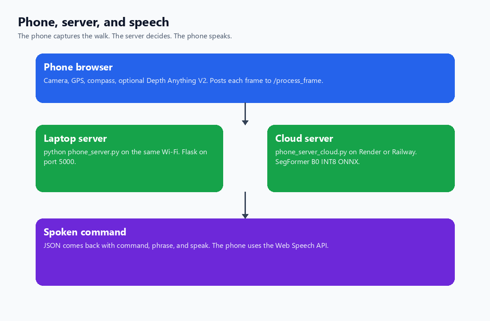
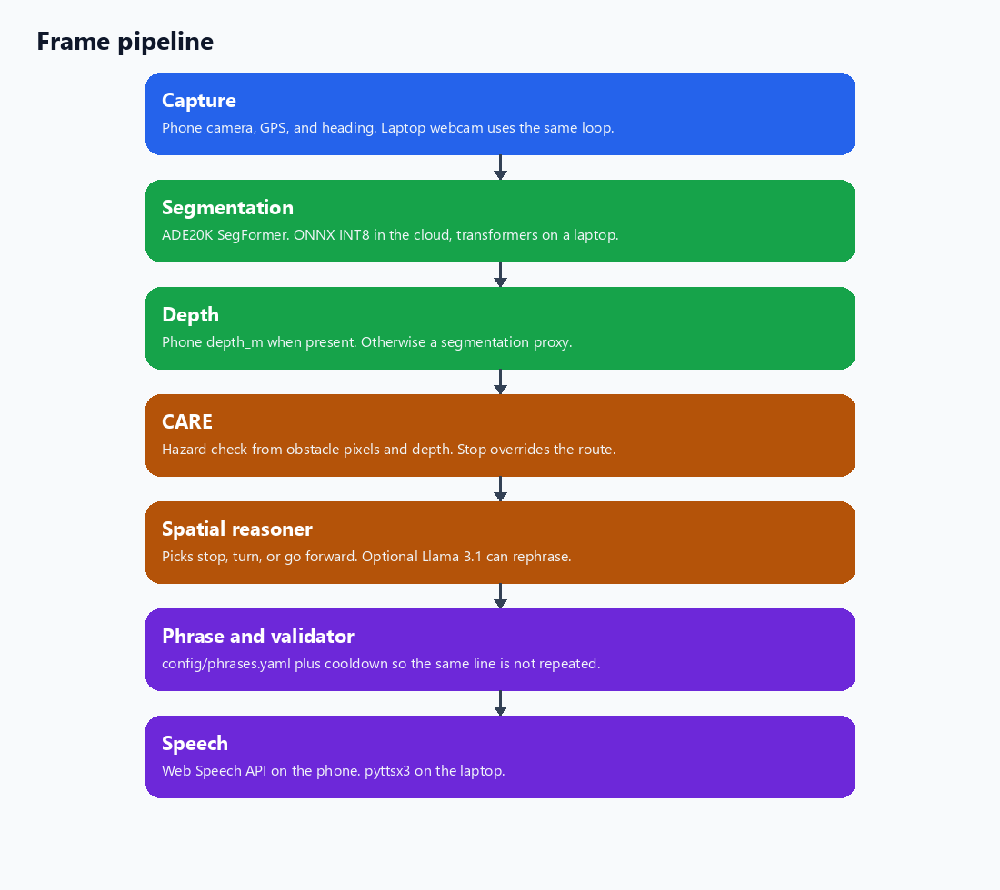
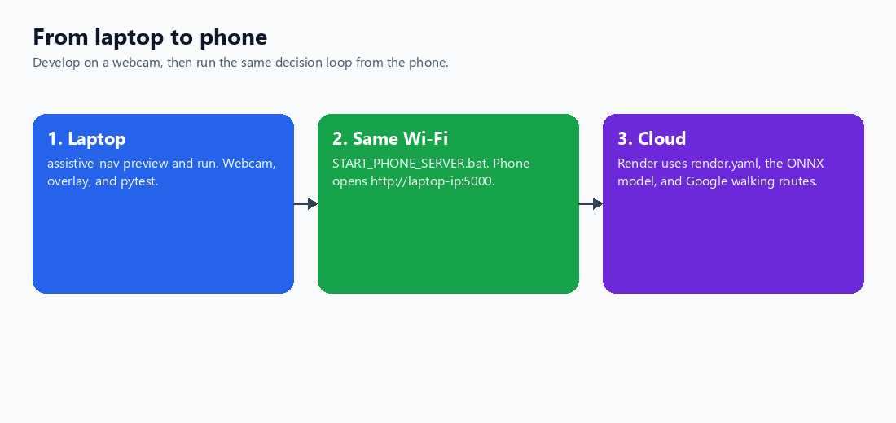
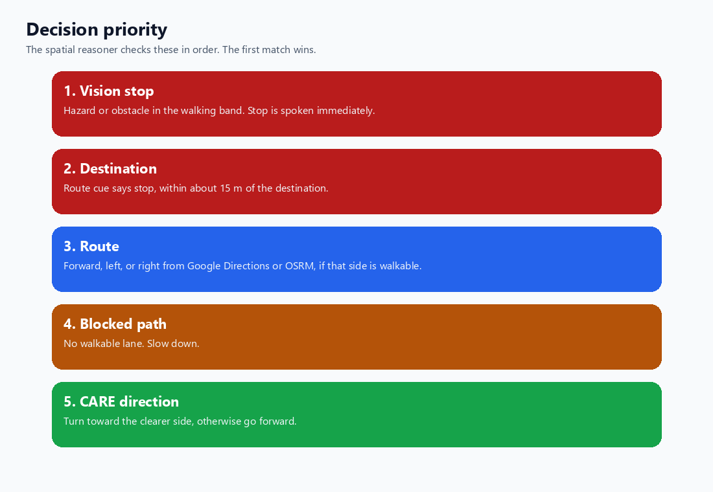

# Smart Cane AI

Real-time walking guidance from a phone camera. The phone sends each frame, GPS, and heading to a Python server. The server segments the scene, checks obstacles, and follows a walking route, then returns a short spoken command such as “Stop”, “Move left”, or “Go forward”.

The phone speaks the phrase with the Web Speech API. A laptop CLI (`assistive-nav`) runs the same pipeline from a webcam for local development.

## What it does

| Piece | Role |
|-------|------|
| Phone UI | `phone_client.html` — camera, GPS, compass, optional on-device depth, speech |
| Laptop server | `python phone_server.py` — same Wi-Fi, Flask on port 5000 |
| Cloud server | `phone_server_cloud.py` — Render or Railway (`render.yaml`, `Procfile`) |
| Segmentation | ADE20K SegFormer, 150 classes. Cloud default is INT8 ONNX (`segformer_b0_ade20k_int8.onnx`) |
| Depth | Phone posts `depth_m` from Depth Anything V2, or the server uses a segmentation proxy |
| Safety | CARE heuristic (optional HTTP). Stop wins over route guidance |
| Route | Google Directions walking routes, with OSRM as the no-key fallback |
| Speech | Web Speech API on the phone, pyttsx3 on the laptop |

Segmentation is required. Depth, CARE, and the LLM all fall back to rules when their service is off.

## Architecture

The phone captures the walk, the server decides, and the phone speaks. Develop on a laptop webcam, then use the same loop from the phone on the same Wi-Fi or on Render.

Diagrams: **[docs/DIAGRAMS.md](docs/DIAGRAMS.md)**. Regenerate the PNGs with `python scripts/render_diagrams.py`.

| Diagram | Preview |
|---------|---------|
| Phone, server, and speech |  |
| Frame pipeline |  |
| Laptop to phone |  |
| Decision priority |  |

## Pipeline

```text
Phone camera + GPS + heading
        |
POST /process_frame
        |
ADE20K SegFormer (ONNX INT8 on cloud, transformers locally)
        |
Depth (client meters, else segmentation proxy)
        |
CARE safety check
        |
Spatial reasoner (+ optional Llama 3.1)
        |
Phrase composer + cooldown validator
        |
JSON { command, phrase, speak }
        |
Phone speaks the phrase
```

| Stage | Module |
|-------|--------|
| Capture | `navigation/capture/camera.py` (laptop) or `phone_client.html` |
| Segmentation | `navigation/perception/segmentation_segformer_onnx.py`, `segmentation_segformer.py` |
| Depth | `navigation/perception/depth.py` |
| Safety | `navigation/reasoning/care.py` |
| Decision | `navigation/reasoning/spatial_reasoner.py` |
| Route | `navigation/maps/google_directions.py`, `navigation/maps/router.py` |
| Phrases | `navigation/reasoning/composer.py` |
| Guardrails | `navigation/output/validator.py` |
| Laptop speech | `navigation/output/tts.py` |
| Frame loop | `navigation/pipeline/runner.py` |

Class groups, distance buckets, and phrase templates live in `config/default.yaml` and `config/phrases.yaml`.

## Setup

Python 3.10 or newer. Run these from the cloned repo root.

### PowerShell

```powershell
python -m venv .venv
.\.venv\Scripts\Activate.ps1
pip install -e ".[dev,segformer,server]"
copy .env.example .env
```

### Command Prompt

```bat
python -m venv .venv
.venv\Scripts\activate.bat
pip install -e ".[dev,segformer,server]"
copy .env.example .env
```

| Extra | Install | Purpose |
|-------|---------|---------|
| `segformer` | `pip install -e ".[segformer]"` | torch, transformers, onnxruntime |
| `server` | `pip install -e ".[server]"` | Flask phone server |
| `llm` | `pip install -e ".[llm]"` | OpenAI-compatible Llama client |
| `tts` | `pip install -e ".[tts]"` | pyttsx3 on the laptop |
| `dev` | `pip install -e ".[dev]"` | pytest |

Cloud deploys do not install torch. They use `requirements-cloud.txt` and the ONNX file already in the repo.

### Segmentation settings

| Setting | Laptop default (`.env.example`) | Cloud (`render.yaml`) |
|---------|----------------------------------|------------------------|
| `SEGMENTER_BACKEND` | `segformer` | `segformer_onnx` |
| `SEGFORMER_MODEL_ID` | `nvidia/segformer-b2-finetuned-ade-512-512` | `nvidia/segformer-b0-finetuned-ade-512-512` |
| `SEGFORMER_ONNX_PATH` | — | `segformer_b0_ade20k_int8.onnx` |
| `SEGFORMER_DEVICE` | `auto` | `cpu` |

The B2 checkpoint is slow on CPU. For a laptop demo, set `SEGMENTER_BACKEND=segformer_onnx` or pass `--fast`.

Export a new ONNX file with:

```powershell
python scripts/export_segformer_onnx.py
```

## Run on a laptop

```powershell
assistive-nav preview --camera 0
assistive-nav run --camera 0 --fast
assistive-nav run --image tests\fixtures\sample.jpg --no-llm
```

Press **q** in the overlay window to stop a preview. Press **Ctrl+C** to stop a live run.

If `tests\fixtures\sample.jpg` is missing:

```powershell
python scripts\create_sample_fixture.py
```

Map demo (vision stop still overrides the route):

```powershell
assistive-nav run --no-llm --use-map `
  --current "40.7484,-73.9857" `
  --dest "40.7510,-73.9830" `
  --image tests\fixtures\sample.jpg
```

`--dest-address "Empire State Building, New York"` geocodes through Nominatim. A successful route is written to `output/route.json`.

| Command | Meaning |
|---------|---------|
| `go_forward` | On the route and aligned with the next waypoint |
| `move_left` / `move_right` | Turn toward the path, or step back when far off it |
| `stop` | Near the destination, or an obstacle in the walking band |

## Run from a phone

On the laptop, same Wi-Fi as the phone:

```powershell
python phone_server.py
```

Or double-click `START_PHONE_SERVER.bat`. Open `http://<laptop-ip>:5000/` on the phone, allow camera and location, set a destination, then start the camera.

Cloud: connect this repo on [Render](https://render.com) using `render.yaml`. Build command `pip install -r requirements-cloud.txt`. Start command:

```text
gunicorn phone_server_cloud:app --bind 0.0.0.0:$PORT --workers 1 --timeout 120
```

Set `GOOGLE_MAPS_API_KEY` in the host dashboard. Without it, routes fall back to OSRM. Details: [RENDER_DEPLOYMENT.md](RENDER_DEPLOYMENT.md).

The phone can estimate depth itself (Depth Anything V2 Small, WebGPU with a WASM fallback) and post it as `depth_m`. The `/process_frame` response field `depth_source` is `client` or `proxy`. Meters are approximate. Tuning notes: [PHONE_DEPLOYMENT_GUIDE.md](PHONE_DEPLOYMENT_GUIDE.md).

## Tests

```powershell
pytest
```

## More docs

| Guide | Contents |
|-------|----------|
| [ARCHITECTURE.md](ARCHITECTURE.md) | Phone client, cloud server, per-frame data flow |
| [RUN_GUIDE.md](RUN_GUIDE.md) | CLI modes: preview, live camera, `--fast`, `--demo` |
| [WALKING_GUIDE.md](WALKING_GUIDE.md) | Outdoor walking with `walking_mode.bat` |
| [PHONE_DEPLOYMENT_GUIDE.md](PHONE_DEPLOYMENT_GUIDE.md) | Phone client and on-device depth |
| [RENDER_DEPLOYMENT.md](RENDER_DEPLOYMENT.md) | Render web service |
| [DEPLOYMENT_CHECKLIST.md](DEPLOYMENT_CHECKLIST.md) | Pre-deploy checks |
| [VIDEO_PROCESSING_GUIDE.md](VIDEO_PROCESSING_GUIDE.md) | Replay a recorded walk |

## Layout

```text
config/                  default.yaml, phrases.yaml
navigation/              capture, perception, reasoning, maps, output, pipeline
phone_client.html        phone UI
phone_server.py          laptop Flask server
phone_server_cloud.py    cloud entrypoint
segformer_b0_ade20k_int8.onnx
scripts/                 fixture, ONNX export, smoke checks
tests/
```

## Limits

This is guidance software, not a certified mobility or medical device. Lighting, latency, and model mistakes can produce a bad suggestion. The validator cuts repeated speech. It does not make a command safe. Try it in a controlled space before relying on it while walking.
