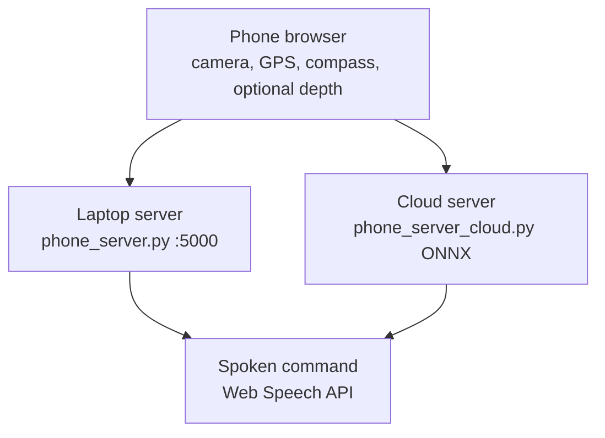
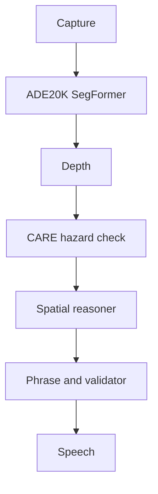

# Architecture diagrams

PNG previews used on the repository README. Regenerate them with:

```powershell
python scripts/render_diagrams.py
```

| Diagram | File |
|---------|------|
| Phone, server, and speech | [images/01-system-context.png](images/01-system-context.png) |
| Frame pipeline | [images/02-pipeline-architecture.png](images/02-pipeline-architecture.png) |
| Laptop to phone | [images/03-roadmap-dev-to-glasses.png](images/03-roadmap-dev-to-glasses.png) |
| Decision priority | [images/05-decision-priority.png](images/05-decision-priority.png) |

## Phone, server, and speech



## Frame pipeline



## Decision priority

The spatial reasoner uses the first match:

1. Vision stop when a hazard is in the walking band.
2. Stop near the destination.
3. Route cue (forward, left, or right) when that side is walkable.
4. Slow down when every lane is blocked.
5. CARE direction otherwise.
